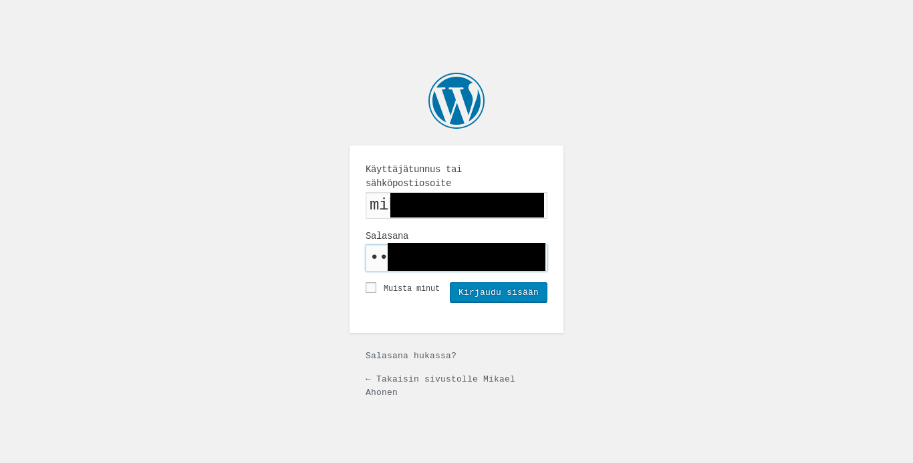
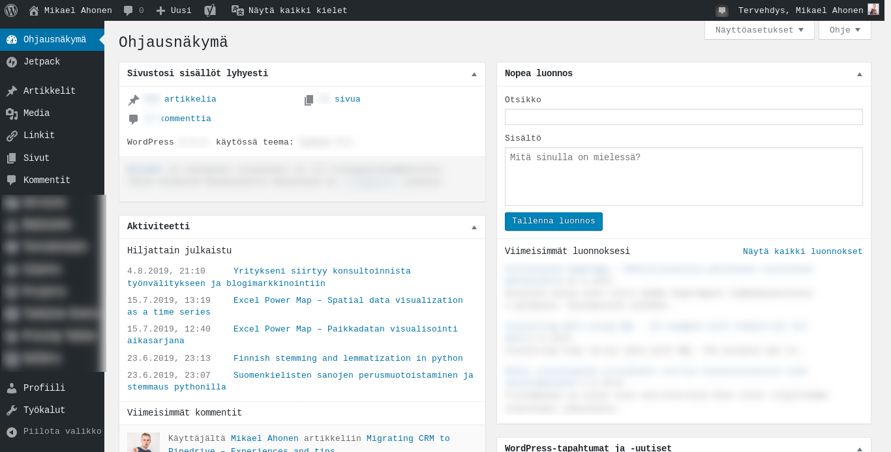
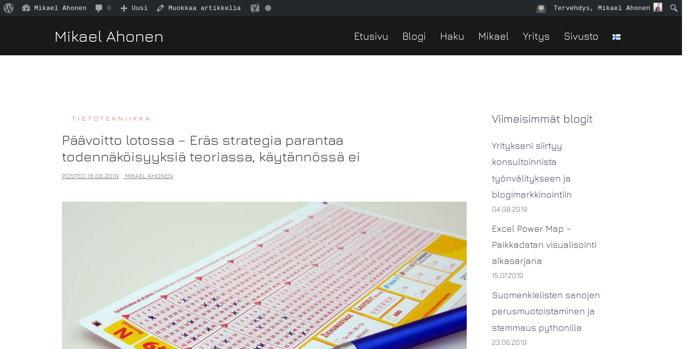

# Convert Wordpress post draft to PDF with browser automation

The intention was to create a python utility to download a web page as PDF, when the site requires login.

I "needed" this kind of functionality to send a Wordpress blog post draft to my friend as a PDF. Ofcourse the project was more about curiosity.

## How did it work
The whole process is automated. The screenshots are taken by the python program.

First, the headless browser goes to the Wordpress login page. The credentials are saved in the configuration file:



The code checks a few times if the login was succesfull:


The browser goes to the actual page of the Wordpress post draft. The PDF file will be rendered from the html. Remember, that this page is not publicly visible in the internet:


The output PDF was pretty good. Some elements were positioned slightly off, but for example the fonts and icons were in place.

## How to use
1. Clone the repository
2. Install [Firefox](https://askubuntu.com/questions/997192/how-do-i-install-firefox) and [geckodriver](https://askubuntu.com/questions/870530/how-to-install-geckodriver-in-ubuntu) to your computer
3. Install `python-selenium` and `pdf-kit` python packages
3. Rename the `config_example.py` to `config.py`
4. Fill in the correct parameters to `config.py`
5. Run `wp-pdf.py` from the directory of this project
6. If you face problem, read about the issues from this document

Depending on your system configuration, the commands are something like this:
```sh
pip3 install pdfkit selenium
sudo apt update
sudo apt install wkhtmltopdf
sudo apt install firefox
cd ~
wget https://github.com/mozilla/geckodriver/releases/download/v0.24.0/geckodriver-v0.24.0-linux64.tar.gz
tar -xvzf geckodriver*
chmod +x geckodriver
sudo mv geckodriver /usr/local/bin/
```

## Technical review

Without the login requirement, you could generate a PDF from web page simply by:

```py
import pdfkit
pdfkit.from_url('https://example.com', 'output.pdf')
```

If you are satisfied to have screenshots only, it is easily achieved with Selenium. After initializing the selenium browser driver the full page screenshot would work like this:
```py
driver.get('https://example.com')
screenshot_data = driver.page_source.find_element_by_tag_name('body').screenshot_as_png
f_img = open('screenshot.png', 'wb')
f_img.write(screenshot_data)
f_img.close()
```

My approach was to save the page source html with `selenium`, and generate the PDF file with `pdfkit`.  

Other options to deliver the post for the other person would have been:
* Create a temporary Wordpress user (Reveals all the posts for the user)
* Password protect the page (The thumbnail would still be visible on the live website)
* Copy paste to Google Docs (Boring)
* Print as PDF manually from Google Chrome (The layout was messed up)
* Save the html to another password protected directory on the web server (Complicated)
* Wordpress API (Realised too late...)

## Issues with Chrome driver for python selenium
I tried using `Google Chrome` browser and driver for my project. However, I constantly faced some issues. That was probably due to incompatible versions between `selenium` and Chrome. This was the setup:
* Ubuntu `18.04`
* Chrome browser and driver `0.76.xx`
* Selenium package for python `3.141.0`

The solution was to switch to `Firefox` browser and `geckodriver`.

## Issues with pdfkit and Wkhtmltopdf
The `pdfkit` package for python is a wrapper for `Wkhtmltopdf` command line tool. The version `0.6.1` of pdfkit installed the version `0.12.4` of Wkhtmltopdf. The solution was to upgrade to `0.12.5` of Wkhtmltopdf.

```sh
cd ~
wget https://downloads.wkhtmltopdf.org/0.12/0.12.5/wkhtmltox_0.12.5-1.bionic_amd64.deb
sudo dpkg -i wkhtmltox_0.12.5-1.bionic_amd64.deb
sudo apt-get install -f
```

As I used `conda` package manager for python, Wkhtmltopdf was installed to `~/miniconda3/bin` in my case. Not in `/usr/bin` as usual.

The error message was something like this:

```sh
Traceback (most recent call last):
  File "wp-pdf.py", line 44, in <module>
    pdfkit.from_url(f_html, 'export/wp_post.pdf')
  File "/home/ubuntu/miniconda3/lib/python3.7/site-packages/pdfkit/api.py", line 26, in from_url
    return r.to_pdf(output_path)
  File "/home/ubuntu/miniconda3/lib/python3.7/site-packages/pdfkit/pdfkit.py", line 156, in to_pdf
    raise IOError('wkhtmltopdf reported an error:\n' + stderr)
OSError: wkhtmltopdf reported an error:
Loading pages (1/6)
QSslSocket: cannot resolve CRYPTO_num_locks                  ] 10%
QSslSocket: cannot resolve CRYPTO_set_id_callback
QSslSocket: cannot resolve CRYPTO_set_locking_callback
QSslSocket: cannot resolve sk_free
QSslSocket: cannot resolve sk_num
QSslSocket: cannot resolve sk_pop_free
QSslSocket: cannot resolve sk_value
QSslSocket: cannot resolve SSL_library_init
QSslSocket: cannot resolve SSL_load_error_strings
QSslSocket: cannot resolve SSLv3_client_method
QSslSocket: cannot resolve SSLv23_client_method
QSslSocket: cannot resolve SSLv3_server_method
QSslSocket: cannot resolve SSLv23_server_method
QSslSocket: cannot resolve X509_STORE_CTX_get_chain
QSslSocket: cannot resolve OPENSSL_add_all_algorithms_noconf
QSslSocket: cannot resolve OPENSSL_add_all_algorithms_conf
QSslSocket: cannot resolve SSLeay
```

The version `0.12.5` of wkhtmltopdf also solved this error:
```sh
Traceback (most recent call last):
  File "wp-pdf.py", line 20, in <module>
    driver = save_post(driver)
  File "/mnt/c/Users/username/projects/wp-pdf/module.py", line 144, in save_post
    export(driver, "pdf", "wp_post", url=html_path)
  File "/mnt/c/Users/username/projects/wp-pdf/module.py", line 79, in export
    pdfkit.from_url(url, f_path)
  File "/home/ubuntu/.local/lib/python3.6/site-packages/pdfkit/api.py", line 26, in from_url
    return r.to_pdf(output_path)
  File "/home/ubuntu/.local/lib/python3.6/site-packages/pdfkit/pdfkit.py", line 159, in to_pdf
    raise IOError("wkhtmltopdf exited with non-zero code {0}. error:\n{1}".format(exit_code, stderr))
OSError: wkhtmltopdf exited with non-zero code 1. error:
QStandardPaths: XDG_RUNTIME_DIR not set, defaulting to '/tmp/runtime-ubuntu'
qt.qpa.screen: QXcbConnection: Could not connect to display
Could not connect to any X display.
```
